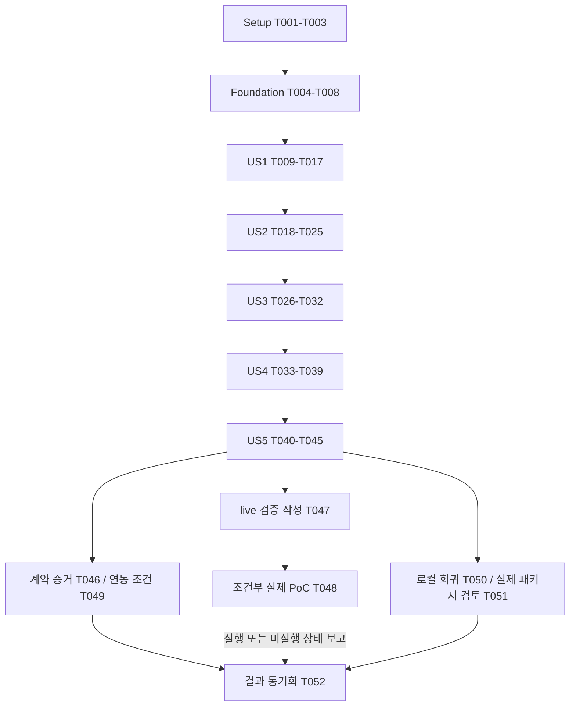

# Tasks: 수집 자료의 근거 검증과 지식 구조화

**Input**: `specs/001-source-knowledge-validation/`의 개정 설계 문서
**Prerequisites**: [plan.md](plan.md), [spec.md](spec.md), [research.md](research.md), [data-model.md](data-model.md), [계약](contracts/structure-contract.md)
**기준**: 헌법 1.0.0, W3 내부 계약 0.2.0-draft, PM 입력 0.1.0-draft/PROPOSED
**Tests**: 명세의 필수 인수 시나리오와 헌법의 검증 의무에 따라 테스트 작업을 포함한다.
**Organization**: 사용자 시나리오 5개별로 구성한다. 아래 체크박스는 전부 미완료이며 작업 목록 생성은 구현 완료가 아니다.

## Format: `[ID] [P?] [Story] Description`

- `[P]`는 기재한 선행 작업이 완료된 뒤 같은 병렬 묶음의 다른 파일 작업과 함께 수행 가능하다는 뜻이다.
- `[US1]`~`[US5]`는 spec의 사용자 시나리오다. Setup·Foundational·Polish에는 story label을 붙이지 않는다.
- 각 작업은 파일 경로, 완료 동작, 요구/인수 연결을 포함한다. 자세한 의미는 [검증 매핑](contracts/validation-matrix.md)을 따른다.
- 현재 요청의 산출물은 이 작업 목록까지다. 아래 파일 생성·코드 구현·실제 PoC는 후속 실행 작업이다.

## Path Conventions

단일 Python 패키지 `src/w3_knowledge/`와 `tests/`를 사용한다.
문서 경로는 저장소 루트 기준이며 현재 기능 경로는 `specs/001-source-knowledge-validation/`다.
실제 기업 원문·첨부·로컬 분석 내용은 공개 fixture로 복사하지 않는다.
`tmp/w3-local-review/`는 공개 제외된 로컬 검토용이며 애플리케이션의 자동 로그·결과 저장 경로가 아니다.

## Phase 1: Setup (Shared Infrastructure)

**Purpose**: 범위·미결 결정·패키지·비공개 자료 보호 기준을 마련한다.

- [ ] T001 `specs/001-source-knowledge-validation/contracts/decision-register.md`에 W2/W3/W1/W4 소유자·소비자, 내부 0.2.0-draft와 두 샘플 버전, 원래/발췌 위치·해시 대상·upstream 검사 수용·권한 정책의 OPEN 항목과 필요한 증거를 기록한다. 합성 로컬 구현과 공유/운영 적용의 조건을 구분하고 실제 합의를 만들어 적지 않는다. (헌법 VIII; FR-001, FR-007, FR-014)
- [ ] T002 T001의 로컬 draft 범위에서 `pyproject.toml`, `uv.lock`, `src/w3_knowledge/__init__.py`를 생성한다. Python 3.12 호환과 Pydantic v2·Upstage 호환 SDK·pytest/Ruff dev 그룹을 검증해 버전을 잠그고 정적 검사 설정을 둔다. 서버·DB·Job·검색 의존성을 추가하지 않는다. (plan Technical Context; FR-020)
- [ ] T003 `.gitignore`에 실제 PM 패키지·기존 수집 샘플·`tmp/w3-local-review/`·비밀 설정을 공개 제외하도록 설정하고 `tests/contract/test_artifact_exclusion.py`에서 명시된 입력/출력 경로가 배포·fixture 대상에 포함되지 않는지 검사한다. 기존 파일을 삭제하거나 이동하지 않는다. (FR-019, FR-020; 헌법 IX)

**Checkpoint**: 로컬 실험의 선언과 보호 설정이 준비된다. T001의 OPEN 기록이 GATE 통과를 뜻하지 않는다.

## Phase 2: Foundational (Blocking Prerequisites)

**Purpose**: 원문·권한·검사·결과를 분리하는 공통 타입과 테스트 경계를 제공한다.

- [ ] T004 `src/w3_knowledge/models.py`에 data-model의 불변 입력·후보·Requirement 조건 노드·검사·결과 DTO를 구현한다. strict 타입, 미지원 필드/버전 거부, null 의미, ID namespace, 원래 근거 ID, 두 위치 기준, upstream 해시/검사 보고, 미보존/미선택 필드를 포함한다. 의미·권한 상태의 자기 선언을 후보 입력에서 거부한다. (FR-001, FR-006, FR-007, FR-014, FR-018)
- [ ] T005 T004 뒤 `src/w3_knowledge/ports.py`에 PolicyPort·RetainedTextPort·ExtractionPort·SemanticValidationPort·AdditionalVerificationPort의 입력/출력 경계를 정의한다. 임의 URL/파일 fetch와 정책 덮어쓰기 경로를 제공하지 않는다. (FR-003, FR-004, FR-017, FR-019)
- [ ] T006 T004~T005 뒤 `src/w3_knowledge/config.py`와 `src/w3_knowledge/errors.py`에 모드·목적·모델/스키마/정책 버전·명시적 한도 설정 및 안전한 오류 코드를 구현한다. LIVE 운영과 PROVIDER_POC를 구분하고 설정/허용 미확인은 거부한다. 원문·SDK body·키·locals가 로그에 출력되지 않게 한다. (FR-007, FR-017, FR-019, FR-020)
- [ ] T007 T004~T006 뒤 `tests/support/fakes.py`와 `tests/fixtures/synthetic/normal/`에 가상의 출처·원문·검사/권한 대역과 사전 정답을 분리해 작성한다. 일반 Claim 1개·Requirement 2개 기대값을 유지하고 real 샘플의 원문을 복사하지 않는다. (FR-020; SC-002)
- [ ] T008 T007 뒤 `tests/conftest.py`에 합성 기본 실행, 명시적 `--run-live`·`--pm-sample`·`--legacy-sample` 옵션과 안전한 실패 출력을 구성한다. 옵션 없이 네트워크/실제 패키지를 읽지 않고, 명시한 경로의 오류를 SKIPPED로 숨기지 않는다. (FR-019, FR-020; SC-007, SC-009)

**Checkpoint**: T001~T008 완료 후 사용자 시나리오 구현을 시작한다.
실제 인증·보존 서비스는 아직 구현됐다고 가정하지 않는다. 테스트 대역은 운영 기본값이 아니다.

## Phase 3: User Story 1 - 입력의 누락과 보완 범위 확인 (Priority: P1)

**Goal**: 합성 정상 입력·기존 요약 샘플·새 PM 입력의 제공 정보와 제한을 자료별로 구분한다.
**Independent Test**: 추출기 호출 없이 AS-101~AS-108을 검사한다. 원문/버전이 있는 PM 입력에 부재 진단을 일괄 적용하지 않는다.
**최소 시연 범위**: 입력 검토까지의 첫 증분이다. 제품 MVP나 전체 기능 완료를 뜻하지 않는다.

### Tests for User Story 1

먼저 아래 테스트를 작성하고 아직 구현되지 않은 동작 때문에 실패하는지 확인한다.

- [ ] T009 [P] [US1] `tests/acceptance/test_input_review.py`에 AS-101, AS-103, AS-105, AS-108의 정상·누락·부분 처리·AVAILABLE/의도적 미보존·다운로드 성공/HTTP 기록 부재 사례를 작성한다. 합성 입력의 source별 진단과 실제 영향 범위를 검증한다. (FR-001, FR-002; SC-001, SC-009)
- [ ] T010 [P] [US1] `tests/contract/test_collection_sample.py`, `tests/contract/test_observed_package.py`에 두 어댑터의 합성 대응 회귀와 명시적 로컬 입력 검사를 작성한다. AS-102, AS-107의 원래 ID/부모 참조·버전·보고 출처를 검사하고, 잘못된 Pointer·경로 탈출·중복 ID·미지원 버전을 거부하게 한다. (FR-001, FR-017, FR-018, FR-020; SC-003, SC-009)
- [ ] T011 [P] [US1] `tests/unit/test_evidence.py`와 `tests/contract/test_input_policy.py`에 AS-104, AS-106의 기대 해시 미계산/불일치, 허용 미확인/거부 및 원문 읽기 전 차단을 작성한다. 제공된 hash와 현재 검사 결과를 분리한다. (FR-003, FR-004, FR-019; SC-001, SC-007)

### Implementation for User Story 1

- [ ] T012 [US1] `src/w3_knowledge/review.py`에 envelope와 자료별 오류 분리, 수집/파싱/보존/현재 접근 상태, 의도적 미보존, 의존 첨부·자료 완전성 진단을 구현한다. 필요 여부가 미상인 첨부를 임의 필수로 만들지 않는다. (T009~T011 이후; FR-001, FR-002, FR-016)
- [ ] T013 [US1] `src/w3_knowledge/evidence.py`에 불변 발췌·기대/관찰 digest·해시 대상 구분·기본 인용/버전 검사를 구현한다. 원문이 있는 PM 발췌를 RAW_TEXT_MISSING으로 처리하지 않고 재현하지 못한 대상 검사는 PENDING으로 남긴다. (T012 이후; FR-003, FR-006, FR-007)
- [ ] T014 [P] [US1] `src/w3_knowledge/adapters/collection_sample.py`에 기존 요약 파일 변환을 구현한다. 2 Source·9 요약 구간·3 첨부 진단과 원래 ID를 보존하고 요약을 Evidence로 바꾸지 않는다. (T012~T013 완료 후; FR-001, FR-002, FR-003, FR-020)
- [ ] T015 [P] [US1] `src/w3_knowledge/adapters/observed_package.py`에 새 PM 두 JSON의 ID·부모 관계·원래 locator·upstream 해시/검사 보고·날짜/미보존/미선택 매핑을 구현한다. 상대 참조는 이미 제공된 두 객체 안에서만 해소하며 다운로드·파서·OCR을 호출하지 않는다. (T012~T013 완료 후; FR-001, FR-002, FR-006, FR-007, FR-017, FR-018)
- [ ] T016 [US1] `src/w3_knowledge/service.py`에 PolicyPort의 사전 검사와 입력 검토 결과를 연결한다. 추출 전 진단 경로가 빈 입력·전역 계약 오류·자료별 부분 오류를 구분해 SourceReview와 제한을 반환하게 한다. (T014~T015 이후; FR-004, FR-014, FR-016, FR-019)
- [ ] T017 [US1] `tests/acceptance/test_input_review.py`, `tests/contract/test_collection_sample.py`, `tests/contract/test_observed_package.py`, `tests/unit/test_evidence.py`, `tests/contract/test_input_policy.py`를 실행해 AS-101~AS-108을 확인하고 `specs/001-source-knowledge-validation/validation-results.md`에 합성/로컬 실행 여부와 실패·제한을 기록한다. (T016 이후; SC-001, SC-003, SC-007, SC-009)

**Checkpoint**: 입력 검토를 독립적으로 시연할 수 있다. 새 패키지의 현재 검증 완료·공용 사용 가능 목록을 임의로 채우지 않는다.

## Phase 4: User Story 2 - 원문까지 추적 가능한 Claim 확인 (Priority: P1)

**Goal**: 충분한 합성 원문에서 Claim을 만들고, 원래 근거·보존 발췌·검사 출처를 추적한다.
**Independent Test**: AS-201~AS-208에서 정상 Claim을 생성하고 계획→성과 변형·근거 불일치·필수 추가검증 미완료를 차단한다. 실제 PM 검토 예시는 별도 수동 초안이다.

### Tests for User Story 2

- [X] T018 [P] [US2] `tests/acceptance/test_claims.py`, `tests/unit/test_native_locators.py`, `tests/unit/test_versions.py`에 AS-201~AS-208을 작성한다. 분해형 한글·이모지·CRLF, 원문 offset 82~96과 발췌 offset 0~14 구분, 전체 hash/발췌 hash 혼용, upstream boolean 자기 승격, 입력 불변을 검사한다. (FR-003, FR-005, FR-006, FR-007, FR-018, FR-021)
- [ ] T019 [P] [US2] `tests/provider/test_solar_mock.py`에 추출 후보와 의미 검증 응답 스키마를 분리한 HTTP Mock 검사를 작성한다. 잘린 JSON·미지원 필드/enum·거짓 근거·도구 호출을 성공으로 보수하지 못하게 한다. (FR-005, FR-006, FR-007, FR-017)

### Implementation for User Story 2

- [ ] T020 [US2] `src/w3_knowledge/evidence.py`에 원래 Evidence ID/버전·native locator와 발췌 위치 연결, 보고된 검사/현재 검사/대역 분리, 재현 범위 판정을 구현한다. 발췌 자기 대조 PASS와 원래 위치 PENDING이 함께 표현돼야 한다. (T018~T019 이후; FR-003, FR-006, FR-007, FR-018, FR-021)
- [ ] T021 [US2] `src/w3_knowledge/adapters/solar.py`에 명시적 모델·프롬프트·스키마 버전의 후보 추출 및 별도 의미 검증 호출을 구현한다. 원문은 비신뢰 입력, tools는 비활성, SDK max_retries=0으로 두고 실제 공급자 실행은 허용된 목적/설정에만 연결한다. (T020 이후; FR-005, FR-007, FR-017, FR-019)
- [ ] T022 [US2] `src/w3_knowledge/validation.py`에 진술 유형·주체·대상·시점·수치·범위의 대조와 추가검증 포트 결합, FAILED/PENDING/VERIFIED 계산을 구현한다. 검사 정책 부재를 NOT_REQUIRED로 바꾸거나 모델 자기 판정으로 검증을 면제하지 않는다. (T021 이후; FR-005, FR-006, FR-007, FR-011)
- [ ] T023 [US2] `src/w3_knowledge/service.py`에 입력 검토→후보→기계적 검사→의미/추가검증을 연결한다. 외부 전송 직전에 허용/참조를 재검사하며 결과는 사용한 버전·근거·미완료 검사와 함께 반환한다. (T022 이후; FR-004, FR-005, FR-014, FR-019)
- [ ] T024 [US2] `tmp/w3-local-review/pm-analysis.json`에 PM Evidence 6개 각각의 수동 검토 초안 또는 생성 보류 사유를 작성한다. 원래 source/version/evidence 참조, 문맥 보완, MANUAL_REVIEW_DRAFT, 검증·활용 제한을 포함하고 원문/후보를 공개 문서·fixture에 복사하지 않는다. 파일이 없거나 로컬 처리 범위가 확인되지 않으면 해당 검토를 미실행으로 기록한다. (T003·T015·T022 이후; FR-005, FR-006, FR-007, FR-019, FR-020)
- [ ] T025 [US2] `tests/acceptance/test_claims.py`, `tests/unit/test_native_locators.py`, `tests/unit/test_versions.py`, `tests/provider/test_solar_mock.py`를 실행하고 `specs/001-source-knowledge-validation/validation-results.md`에 AS-201~AS-208 및 Claim 전용 합성 입력의 기대 Claim 1개 생성/변형 거부 결과를 기록한다. T024의 로컬 자료 미제공은 별도 미실행으로 남기고 독립 합성 검증을 막지 않는다. 실제 모델·원문 재검증을 수행한 것으로 표시하지 않는다. (T023 이후; SC-002, SC-006, SC-008, SC-009)

**Checkpoint**: 정상 Claim과 제한된 근거를 구분한다. 로컬 검토 예시와 검증된 공용 결과는 서로 다른 산출물이다.

## Phase 5: User Story 3 - 명시 요구의 의미와 결합조건 확인 (Priority: P1)

**Goal**: 필수성·AND/OR·부정/예외·동일 경험·기술 원문·공고 범위를 보존한다.
**Independent Test**: AS-301~AS-307의 합성 정답과 비교하며 짧은 발췌·미보존 항목을 완전한 요구로 확정하지 않는다.

### Tests for User Story 3

- [X] T026 [P] [US3] `tests/acceptance/test_requirements.py`와 `tests/fixtures/synthetic/requirements/`에 AS-301~AS-307의 사전 정답·변형 후보를 작성한다. 필수/우대/일반, 같은 경험의 OR 결합, 비교·예외, 문맥/직무 범위 부족을 검사한다. (FR-008, FR-009, FR-010, FR-011, FR-016)
- [ ] T027 [P] [US3] `tests/unit/test_condition_tree.py`에 평면 노드의 단일 루트·자식 참조·인자 수·부모 수·연결성·순환 검사와 원문 근거 불일치 사례를 작성한다. (FR-006, FR-009)

### Implementation for User Story 3

- [ ] T028 [US3] `src/w3_knowledge/requirements.py`에 조건 트리 검증, 필수성/미명시 구분, 비교·제외·동일 경험 의미, 문맥 부족에 따른 미확정 상태를 구현한다. 사용자 Episode 충족 판정은 만들지 않는다. (T026~T027 이후; FR-008, FR-009, FR-016)
- [ ] T029 [US3] `src/w3_knowledge/skills.py`에 원래 기술 표현과 명확한 약어/검토된 사전 근거 연결을 구현한다. Java/JavaScript 등 유사 명칭 병합과 미파싱 자료의 기술 추정을 거부한다. (T028 이후; FR-010)
- [ ] T030 [US3] `src/w3_knowledge/adapters/solar.py`와 `src/w3_knowledge/validation.py`에 Requirement 평면 노드 스키마·조건별 의미 검증을 연결한다. recursive 공급자 스키마·조건 생략·문맥 없는 요구 확정을 허용하지 않는다. (T029 이후; FR-006, FR-007, FR-008, FR-009)
- [ ] T031 [US3] `src/w3_knowledge/service.py`에 Requirement 출력과 범위별 NOT_ASSESSED/NONE_IN_EXAMINED_SCOPE를 연결한다. 검토를 마치지 않은 빈 출력은 부재로 표시하지 않고, 같은 요구를 일반 Claim과 Requirement로 중복 복제하지 않는다. (T030 이후; FR-005, FR-014, FR-016)
- [ ] T032 [US3] `tests/acceptance/test_requirements.py`, `tests/unit/test_condition_tree.py`를 실행하고 `specs/001-source-knowledge-validation/validation-results.md`에 AS-301~AS-307의 의미 보존과 기본 합성 Claim 1개·Requirement 2개 결과를 기록한다. (T031 이후; SC-002, SC-004, SC-009)

**Checkpoint**: 문항·개인 경험 없이 명시 요구를 독립 검증할 수 있다.

## Phase 6: User Story 4 - 활용 가능한 범위와 제한을 함께 전달받기 (Priority: P1)

**Goal**: 소비자가 사용 가능한 내용, 자료 누락, 검사 미완료, 권한 제한, 미선택 안내를 구분한다.
**Independent Test**: AS-401~AS-407과 권한 철회·부분 실패·공급자 오류를 합성 검증한다.

### Tests for User Story 4

- [ ] T033 [P] [US4] `tests/acceptance/test_bundle.py`에 AS-305, AS-401~AS-403, AS-407을 작성한다. 본문 정상/필수 첨부 미확보·미선택 안내·게시일/시간대 미상·의도적 미보존·정상 검토 후 요구 없음의 차이를 검증한다. (FR-002, FR-011, FR-014, FR-015, FR-016)
- [ ] T034 [P] [US4] `tests/acceptance/test_boundaries.py`에 AS-106, AS-404~AS-406 및 읽기/전송/반환 직전 권한 철회, 삭제 참조 재입력, 평가 모드·목적 누출, 관계/검사/버전 메타데이터의 간접 노출 방지 사례를 작성한다. (FR-004, FR-017, FR-019, FR-020)

### Implementation for User Story 4

- [ ] T035 [US4] `src/w3_knowledge/projection.py`에 W2_REVIEW/W4_KNOWLEDGE 투영과 반환 전 권한 재검사를 구현한다. VERIFIED+USABLE만 사용 목록에 두고, 검사 참조를 해소하며 비공개 ID·관계·집계를 제거한다. LIVE+PRODUCTION_STRUCTURE 이외 결과는 운영 소비를 거부한다. (T033~T034 이후; FR-004, FR-007, FR-014, FR-019, FR-020)
- [ ] T036 [US4] `src/w3_knowledge/service.py`와 `src/w3_knowledge/adapters/solar.py`에 429/사용 한도/잘린 응답/부분 실패를 연결한다. 이미 완료한 자료를 유지하되 429 이후 공급자 호출을 멈추고 미처리 범위·제공된 Retry-After만 반환한다. 자동 재시도·선택·Job·OCR을 실행하지 않는다. (T035 이후; FR-002, FR-014, FR-015, FR-017)
- [ ] T037 [US4] `src/w3_knowledge/cli.py`에 quickstart의 `validate --fixture --mode synthetic`, `diagnose-sample --input`, `diagnose-sample --package`를 구현한다. 두 샘플 옵션은 상호 배타적이며 경로는 호출자가 지정한다. 기본 출력은 안전한 검사 ID·건수·제한 코드이고 원문/응답 자동 저장은 없다. (T036 이후; FR-014, FR-019, FR-020)
- [ ] T038 [US4] `tests/provider/test_solar_mock.py`와 `tests/contract/test_cli.py`에 429 이후 호출 0·SDK 재시도 0·오류 코드 누락·CLI 종료 코드/입력 모드 검사를 추가한다. 제한 진단 성공과 자료 검증 완료를 구분한다. (T037 이후; FR-007, FR-014, FR-015)
- [ ] T039 [US4] `tests/acceptance/test_bundle.py`, `tests/acceptance/test_boundaries.py`, `tests/provider/test_solar_mock.py`, `tests/contract/test_cli.py`를 실행하고 `specs/001-source-knowledge-validation/validation-results.md`에 AS-401~AS-407 및 권한/로그 검증 결과를 기록한다. (T038 이후; SC-001, SC-006, SC-007, SC-009)

**Checkpoint**: 제한을 숨기지 않는 결과 계약을 시연한다. 실제 인증·Job·삭제 시스템 전체의 통합 완료를 주장하지 않는다.

## Phase 7: User Story 5 - 중복·수치·상충 자료의 차이 확인 (Priority: P2)

**Goal**: 확인된 동일 진술만 묶고 수치·시점·범위·계보·충돌을 보존한다. P2도 이번 기능의 필수 완료 범위다.
**Independent Test**: AS-501~AS-506의 재게시, 부모/첨부, 서로 다른 수치/기간/범위, ID 충돌을 검사한다.

### Tests for User Story 5

- [ ] T040 [P] [US5] `tests/acceptance/test_relations.py`와 `tests/fixtures/synthetic/relations/`에 AS-501~AS-506의 사전 계보·동등성·충돌 기대값을 작성한다. 부모/첨부와 다른 시점 공고를 자동 독립 근거·대체 관계로 확정하지 못하게 한다. (FR-011, FR-012, FR-013, FR-018)
- [ ] T041 [P] [US5] `tests/unit/test_origin_links.py`에 계보 미상·확인되지 않은 관계·같은 텍스트의 다른 출처·미상 값끼리의 동등성 오판·source/version/namespace 혼동과 반복 순서 변형을 검사한다. (FR-012, FR-013, FR-018)

### Implementation for User Story 5

- [ ] T042 [US5] `src/w3_knowledge/relations.py`에 유형·주체·범위·기간·단위·비교 기준·부정/조건의 확인된 동등성, Origin 및 충돌 관계를 구현한다. 모든 원래 Evidence를 보존하고 계보 미상을 독립성 점수로 바꾸지 않는다. (T040~T041 이후; FR-011, FR-012, FR-013)
- [ ] T043 [US5] `src/w3_knowledge/relations.py`와 `tests/unit/test_versions.py`에 현재 요청/명시된 manifest 범위의 ID·버전 충돌, 결정적 derived_id와 입력 순서 변화의 중복 검사를 구현·검증한다. 정책·모델·프롬프트 변화는 파생 버전으로 구분하고 원본을 덮어쓰지 않는다. (T042 이후; FR-012, FR-018)
- [ ] T044 [US5] `src/w3_knowledge/service.py`와 `src/w3_knowledge/projection.py`에 계보·진술 관계를 통합한다. 권한 투영 후에도 참조가 닫혀 있어야 하며 숨긴 자료의 존재나 독립 근거 수·신뢰 점수를 새로 노출하지 않는다. (T043 이후; FR-012, FR-013, FR-014, FR-019)
- [ ] T045 [US5] `tests/acceptance/test_relations.py`, `tests/unit/test_origin_links.py`, `tests/unit/test_versions.py`를 실행하고 `specs/001-source-knowledge-validation/validation-results.md`에 AS-501~AS-506의 병합/분리·입력 불변·부모/첨부 처리 결과를 기록한다. (T044 이후; SC-005, SC-008, SC-009)

**Checkpoint**: 5개 사용자 시나리오의 로컬 기능 범위가 갖춰진다. 공개 운영 준비는 아래 GATE 증거와 별개다.

## Phase 8: Polish & Cross-Cutting Concerns

**Purpose**: 계약 결정·실제 검증 조건·전체 회귀 결과를 정리한다. 범위 밖 기능은 추가하지 않는다.

- [ ] T046 [P] `specs/001-source-knowledge-validation/contracts/decision-register.md`에 W2/W1/W4가 실제 제공한 계약 검토 결과와 허용·검사 증빙의 수용 기준, 0.2.0 적용/거부/되돌림 순서를 반영한다. 증거가 없으면 OPEN을 유지하고 해당 공유/운영 적용을 차단한다. 담당자에게 자동 메시지를 보내거나 샘플을 승인 증거로 삼지 않는다. (T045 이후; G-01, G-03, G-05; FR-001, FR-007, FR-014)
- [ ] T047 [P] `tests/provider/test_solar_live.py`에 명시적 live 옵션·합성 등록 입력·PoC 목적·키/한도/처리 허용이 있을 때만 실행되는 실제 공급자 검증을 작성한다. 정상 추출과 의미 변형 탐지, 프로젝트 스키마·반환 모델 ID·중단/오류를 사례별로 비교하도록 한다. 이 작업 자체로 API를 호출하지 않는다. (T045 이후; FR-005, FR-007, FR-020; G-02)
- [ ] T048 T047 뒤 필요한 실행 허용·설정이 제공된 경우에만 `tests/provider/test_solar_live.py`를 실제 실행하고 `specs/001-source-knowledge-validation/validation-results.md`에 모델/스키마/정책 버전과 사례별 결과를 기록한다. 조건이 없으면 미실행·필요 증거를 남기고 이 실제 검증 작업과 G-02는 완료 처리하지 않는다. (G-02, G-04, G-07; SC-002, SC-004, SC-007)
- [ ] T049 `specs/001-source-knowledge-validation/contracts/decision-register.md`에서 W1의 현재 권한·보존 참조·철회/삭제 거부와 실제 처리/공유 허용 증거를 확인하고 `tests/acceptance/test_boundaries.py`의 운영 설정 차단 조건에 연결한다. 실제 연동 증거가 없으면 해당 GATE를 OPEN으로 유지한다. W1 인증·전체 삭제·Graph 시스템을 대신 구현하지 않는다. (T046 이후; G-03, G-04, G-05; FR-004, FR-018, FR-019)
- [X] T050 T045 이후 `src/w3_knowledge/`·`tests/`의 Ruff 검사와 unit/contract/acceptance/HTTP Mock 전체 회귀를 quickstart대로 실행한다. `specs/001-source-knowledge-validation/validation-results.md`에 AS 36개·SC 9개별 통과/실패·합성/로컬/live 미실행을 분리한다. T048의 외부 조건을 이유로 독립 로컬 회귀를 중단하지 않는다. (FR-001~FR-021)
- [ ] T051 T037·T045 이후 명시적 로컬 입력으로 `tests/contract/test_observed_package.py`와 CLI 진단을 실행하고, `tmp/w3-local-review/pm-analysis.json`의 원래 ID·미완료 검증·활용 제한 및 `.gitignore` 보호를 확인한다. PM 원본/기존 샘플을 수정하지 않고 `specs/001-source-knowledge-validation/validation-results.md`에는 안전한 건수·검사 결과만 남긴다. (FR-006, FR-007, FR-019, FR-020; SC-009)
- [ ] T052 `specs/001-source-knowledge-validation/quickstart.md`, `specs/001-source-knowledge-validation/contracts/validation-matrix.md`, `specs/001-source-knowledge-validation/tasks.md`와 `specs/001-source-knowledge-validation/validation-results.md`를 실제 구현/검증 상태에 맞춰 동기화한다. 미실행 live·미합의 GATE·실패 작업을 완료로 체크하지 않고 완료 범위를 보고한다. (T046~T051 결과 반영; 헌법 IX, FR-020)

## 구현 실행 현황 — 2026-09-07

원래 작업 목록의 체크박스는 계획 당시 인수조건 전체를 의미한다. 아래는 실제 구현·검증을 마친 작업과, [validation-results.md](validation-results.md)에 기록한 남은 인수조건을 구분한 실행 현황이다.

- [X] T001–T017: 환경·보호 설정, 입력 검토, 기존/PM 어댑터, 합성·계약 검사 구현 및 실행.
- [X] T019–T025: Solar Mock 경계, 근거/후보 검증 경계, 로컬 PM 검토 초안, Claim 관련 검증 실행.
- [X] T027–T032: 조건 트리·기술 표현·Requirement 상태 구현 및 현재 자동화 범위 실행.
- [X] T033–T043, T045–T047: bundle/권한/CLI/관계의 현재 구현, 로컬 검증, 실제 PoC 테스트 코드와 OPEN 기록.
- [X] T044: 동일 Origin Claim의 결정적 중복 제거, 기간·범위가 다른 Claim 보존, W4 투영에서 사용 가능 Claim/Requirement가 참조하지 않는 Evidence 제거.
- [X] T051–T052: 실제 PM·기존 로컬 입력 진단, 결과·Quickstart·검증 매핑 갱신.
- [X] T018, T026, T050: 인수 시나리오 전체를 1:1로 자동화하고 전체 AS/SC 판정을 완료하는 후속 작업.
- [ ] T048: 명시적 provider PoC 허용·설정이 제공될 때 실제 Solar 실행 및 G-02 증거 기록.
- [ ] T049: W1의 실제 권한·보존·철회 처리 증거를 확인해 G-03/G-04/G-05를 판단하는 작업.

## Dependencies & Execution Order

### Phase Dependencies

- Setup T001~T003 → Foundational T004~T008 → US1 T009~T017 → US2 T018~T025 → US3 T026~T032 → US4 T033~T039 → US5 T040~T045.
- 이 기능은 검토→진술→요구→결과 투영→관계 통합의 실제 코드 의존성이 있으므로 사용자 시나리오 전체를 무조건 병렬화하지 않는다.
- 각 시나리오 테스트는 고정 입력과 포트 대역으로 독립 실행 가능하다. 독립 테스트 가능성과 구현 선행 의존성이 없다는 주장은 다르다.
- T046·T047은 US5 완료 후 서로 다른 파일에서 진행한다. T048은 T047 및 명시적 실행 허용/설정에 의존한다.
- T049는 T046의 실제 연동 증거에 의존한다. 없는 증거를 합성 테스트로 대체하지 않는다.
- T050·T051은 해당 로컬 구현 완료 후 독립 실행 가능하며 T048의 외부 대기를 이유로 막지 않는다.
- T052는 모든 결과를 정리하되 미완료 작업·GATE를 완료로 만들지 않는다.

### User Story Dependencies

| 시나리오 | 선행 기반 | 독립 판정 |
|---|---|---|
| US1 | Foundation | 추출기 없이 정상/누락/PM 보고/부분 상태 진단 |
| US2 | US1의 입력·Evidence 경계 | 합성 Claim 생성, 의미 변형 차단, 원래 위치·해시/검사 출처 구분 |
| US3 | US2의 추출·검증 경계 | 요구 조건·기술·문맥 보존, 사용자 자격 판정 없음 |
| US4 | US1~US3의 자료/검증 결과 | 혼합 bundle·미선택·권한·429·로그·평가 모드 경계 |
| US5 | US2/US3의 의미 성분과 US4 투영 | 확인된 동등성·계보·차이·충돌 및 참조 폐쇄성 |

### Within Each User Story

계약/인수 테스트를 먼저 작성하고 의미 있는 실패를 확인한 뒤 구현한다.
모델/포트 변경 → 도메인 처리 → 서비스/소비 연결 → 관련 검증 순서를 유지한다.
같은 `models.py`, `service.py`, `validation.py`, `solar.py`, 결과 문서를 수정하는 작업은 병렬 실행하지 않는다.
완료 체크는 실제 파일·검증 결과가 있을 때만 한다.

### Parallel Opportunities

표시된 작업은 공통 선행 조건을 마친 뒤 아래 예시의 묶음 안에서만 병렬로 처리한다.
공유 fixture·결과 보고서 작성이 추가로 필요해지면 그 부분은 순차 실행한다.

## Parallel Example: User Story 1

- T009 / T010 / T011: 서로 다른 입력·어댑터·근거/권한 테스트 파일 작성.
- T014 / T015: T012~T013 완료 후 기존 요약 어댑터와 PM 어댑터 구현.

## Parallel Example: User Story 2

- T018 / T019: US1 완료 후 Claim/locator/버전 테스트와 공급자 HTTP Mock 작성.
- 이후 Evidence·검증·서비스 변경은 공유 파일 의존성 때문에 순차 진행.

## Parallel Example: User Story 3

- T026 / T027: 요구 의미 인수와 조건 트리 구조 단위 테스트 작성.
- 추출 어댑터·검증기 통합은 T028~T031 순서 유지.

## Parallel Example: User Story 4

- T033 / T034: bundle/미선택 인수와 권한/보안 인수 작성.
- 결과 투영·오류 제어·CLI는 T035~T038 순서 유지.

## Parallel Example: User Story 5

- T040 / T041: 진술 관계 인수와 계보/식별 경계 단위 테스트 작성.
- 관계 도메인·파생 식별·서비스/권한 통합은 T042~T044 순서 유지.

## Implementation Strategy

### MVP First (User Story 1 Only)

첫 시연 증분은 T001~T017의 입력 검토다.
기존 요약 샘플과 PM 관측 자료의 차이·보완 항목을 확인하는 데 가치가 있다.
**이 증분은 제품 MVP 완료나 이 기능 전체 완료가 아니다.** 기능 완료에는 US1~US5와 해당 검증이 모두 필요하다.

### Incremental Delivery

US1 진단 → US2 Claim → US3 Requirement → US4 소비 계약 → US5 계보/충돌 순서로 검증 가능한 증분을 만든다.
이후 로컬 회귀와 명시적 조건이 갖춰진 실제 PoC/연동 증거를 분리해 보고한다.
W4 추천·개인 경험·선택 저장·Graph 적재·임베딩·동기화/삭제 전체 구현을 선행 작업으로 추가하지 않는다.

### Parallel Team Strategy

복수 작업자가 있다면 위 [P] 묶음만 파일 소유를 나누어 수행한다.
현재 실행에서 별도 담당자 메시지 전송이나 다른 영역의 작업 배정을 하지 않는다.
공유 계약·운영 정책은 실제 소유자/소비자의 결정 기록을 사용하고 구현자가 승인 결과를 추정하지 않는다.

## Notes

- 활성 템플릿은 setup-tasks.ps1이 해석한 `.specify/templates/tasks-template.md`다. 확장 설정이 없어 before_tasks/after_tasks 훅은 적용되지 않았다.
- 문서 검증에서 12개 문서의 상대 링크 47개, FR 21개·AS 36개·SC 9개 연결, 52개 작업의 순차 ID·체크박스·라벨·경로 및 병렬 묶음의 파일 충돌 여부를 확인했다. 형식 오류와 누락 연결은 없다.
- PM 두 JSON의 ID·부모/첨부 Pointer·발췌 길이를 확인했고 실제 발췌가 설계 문서에 복사되지 않았음을 검사했다. 원문 사이트·첨부 내용·전체 해시를 재검증한 결과는 아니다.
- 생성된 작업은 52개이며 모두 미완료다. Setup 3개, Foundational 5개, US1 9개, US2 8개, US3 7개, US4 7개, US5 6개, Polish 7개다.
- [P] 작업은 15개다. 선행 조건과 병렬 묶음은 위에 명시했다.
- 애플리케이션·실제 API·DB 검증은 작업 목록 작성 단계에서 수행하지 않았다.
- W2의 수집/파서/OCR, W1의 인증/Job/영구 삭제, W4의 최종 매칭은 이 목록의 구현 범위 밖이다.
- PM 수집 측 PASS, 합성 회귀 PASS, 실제 모델/권한 연동 PASS는 서로 대체할 수 없다.
- 관련 PRD 연결은 spec의 PRD Traceability와 validation-matrix에 유지한다. 기능 FR은 세 자리, 원본 PRD FR은 두 자리로 구분한다.

### Local completion update (2026-09-11)

- [X] T018: AS-201 through AS-208 are covered, including CRLF, decomposed Unicode, emoji, excerpt/origin offsets, source-version mismatch, scoped digest validation, upstream-report separation, and input immutability.
- [X] T026: AS-301 through AS-307 are covered with necessity, technical-term, scope, comparison/exception, partial-attachment, and insufficient-context cases.
- [X] T050: local unit, contract, acceptance, and Solar mock regression; Ruff check and format; synthetic CLI; legacy and observed-package local diagnostics all completed.
- [ ] T048 and T049 remain external-evidence work. They require explicit Solar live authorization/configuration and actual W1 authorization/retention/revocation evidence.
