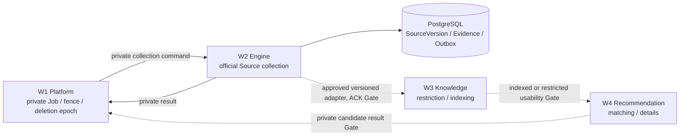

# Project EPICK Agent Engine

> 공식 Source를 수집하고, 검증 가능한 Evidence와 이력을 남겨 EPICK의 지식·추천 파이프라인에 안전하게 전달하는 Agent Engine입니다.

## 📋 프로젝트 소개

EPICK Agent Engine은 공고·웹사이트·공식 API 등 승인된 공식 Source를 수집하여 `SourceVersion`, `Evidence`, 수집 결과를 PostgreSQL에 보존합니다. 이 저장소는 현재 **W2 Source Collection** 구현의 기준 저장소입니다.

W3의 지식 색인·restriction 처리와 W4의 근거 기반 추천은 전체 EPICK 흐름에 포함되지만, 각각 별도 Workstream이 소유합니다. 따라서 이 README는 세 기능의 책임과 연동 조건을 함께 설명하되, 아직 확정되지 않은 계약이나 운영 배포를 완료된 기능으로 표현하지 않습니다.

## 🧑‍💻 Team

<table>
  <tr>
    <td align="center" width="160px">
      <a href="https://github.com/romain1121">
        <br />
        <strong>romain1121</strong><br />
        
      </a>
    </td>
    <td align="center" width="160px">
      <a href="https://github.com/FreeRease">
        <br />
        <strong>FreeRease</strong><br />
        
      </a>
    </td>
  </tr>
</table>

## 🎯 제공 기능

- 승인된 공식 Source의 등록, 수집, 파싱 및 증거 추출
- SourceVersion·Evidence·outbox의 원자적 영속화와 provenance 보존
- 정적 공식 채용공고부터 시작하는 수집 정책 및 파서 검증
- source revision, 수집 실패, 재시도 permit, fence·deletion epoch를 고려한 복구 테스트
- FastAPI 경계, SQLAlchemy/Alembic 기반 PostgreSQL 저장소, Scrapy 수집기

## 🧭 W2 · W3 · W4 협업 구조



| Workstream | 소유 책임                                                                      | 이 저장소에서의 상태                       |
| ---------- | ------------------------------------------------------------------------------ | ------------------------------------------ |
| W2         | 공식 Source 수집, SourceVersion·Evidence·outbox 영속화                         | 구현·테스트 대상                           |
| W3         | Claim/Requirement 해석, knowledge indexing, restriction 상태                   | 별도 구현; 후보 계약 및 채택 Gate 존재     |
| W4         | 근거·제약을 반영한 질문 후보와 추천                                            | 별도 구현; 실운영 연동 Gate 존재           |
| W1         | 인증 principal, private Job/Checkpoint, dispatch, queue, fence, deletion epoch | 플랫폼 권위자; Engine이 중복 구현하지 않음 |

W2의 수집 성공은 W3의 검증·색인 완료를 뜻하지 않으며, W4는 W3가 `INDEXED` 또는 명시적 `RESTRICTED` 상태를 확정하기 전에는 추천을 시작할 수 없습니다.

## 🔐 계약과 데이터 경계

- 공용 event의 바깥 transport envelope는 W1이 소유하며 outer `schema_version`은 `"1.0"`입니다.
- W2의 공용 domain payload는 `schema_version: "w2.source.v1"`으로 선택합니다. event ID·revision 등 transport 필드는 payload에 중복하지 않습니다.
- 공용 계약의 정본 경로는 Service 저장소의 `backend/contracts/common/v1/event-envelope.schema.json`, `backend/contracts/w2/v1/`, `backend/contracts/fixtures/v1/w2/`입니다. Engine 저장소에 이를 복제하지 않습니다.
- 기존 `v0.2 SourceEvent`를 새 envelope payload로 그대로 중첩하거나 덮어쓰지 않습니다.

W1 private transport의 독립 입출력 검증은 `source_collection/w1_transport.py`와
`tests/contract/source_collection/test_w1_transport.py`에서 다룹니다.
`tests/fixtures/w1_private_contract/manifest.json`은 Service
`46d2871c247c6b180ef8d6edc2139da1a04e2928`의 private 계약/합성 fixture를
오프라인 test input으로 고정한 것이며, 공용 event 정본 복제나 W1 계약 소유권 이전이 아닙니다.
codec은 HTTP/queue/DB나 기존 worker 실행·commit 권한 경로에 연결되지 않습니다.
`AVAILABLE` 응답만으로 실행 슬롯 또는 commit 권한이 확보됐다고 판단하지 않습니다.
단독 등록·CT-13, Core Decision pin 결속, 취소·삭제와 commit 원자성 및 실제 W1 runtime은
추가 회신·통합 검증이 필요합니다. 현재 upstream `decided_by` 대소문자와 partial-result
`continue_limited` action의 W2 runtime 불일치는 snapshot에서 수정하지 않습니다.
정책 판정 전 실패의 `policy_revision=null`도 현재 W2에서는 유효하지만 pinned result Schema는
거부하므로, 실제 연결 전 W1 정본과 정렬해야 하는 별도 호환성 Gate입니다.
- W3 C-01 `0.2-candidate/r2`를 위한 W2 versioned adapter와 HTTP publisher는 `source_collection/w3_public_transport.py`에 있습니다. 내부 `SourceEvent`를 그대로 송신하지 않고 W1 outer envelope `1.0`과 W2 payload `w2.source.v1`로 변환합니다. 제한 변경은 저장과 같은 transaction에서 공용 outbox에 기록하며 `source_collection/w3_outbox_operator.py`가 W3의 정확한 `receipt=COMMITTED`와 event ID를 확인한 뒤에만 전달 완료로 표시합니다. 이 receipt는 W3 index ACK가 아닙니다. 실제 W3 process·배포 환경에서의 공동 E2E와 W1 운영 연결은 아직 별도 Gate입니다.
- W3의 `SourceAuthority.is_registered` 입력은 W2의 별도 내부 `GET /internal/v1/sources/{source_id}/authority`에서 제공합니다. 등록 여부는 W2 `sources` PK의 존재로만 판정하고, DB 장애는 미등록(`false`)이 아닌 `503`입니다. `source_collection/source_authority_operator.py:create_app`이 W2 DB와 주입된 `EPICK_W2_SOURCE_AUTHORITY_TOKEN`을 연결합니다. W1은 이 내부 경로의 network/TLS·secret 주입·배포를 담당하며 공개 owner API로 대체하지 않습니다.
- W4의 public input에는 owner/user, private Job·Checkpoint correlation, 원문 Source body, credential, model key를 넣지 않습니다. 민감한 private lifecycle은 W1 경계에서 관리합니다.

## 🛠️ 기술 스택

| 영역             | 구성                                     |
| ---------------- | ---------------------------------------- |
| Language         | Python 3.12                              |
| API · Validation | FastAPI, Pydantic                        |
| Collection       | Scrapy                                   |
| Persistence      | PostgreSQL, SQLAlchemy, Alembic, Psycopg |
| Verification     | pytest, Ruff, mypy                       |
| Local database   | Docker Compose (`compose.test.yaml`)     |

### W3 · Knowledge & Restriction


W3는 source restriction 상태와 knowledge indexing을 담당하며, SQLite/FTS5 기반의 로컬 색인·replay/snapshot recovery 경계를 보유합니다. 공용 연동은 후보 계약 검증 단계이므로 이 스택은 W3의 로컬 구현 기준입니다.

### W4 · Recommendation


W4는 safe HTTP router, input validation, contract fixture 검증을 기반으로 추천 경계를 구현합니다. 실제 provider 호출과 운영 데이터 연동은 별도 Gate이며, badge는 현재 확인된 W4 구현 범위만 나타냅니다.

## 📁 프로젝트 구조

```text
Project_EPICK_Engine/
├── src/epick_engine/source_collection/
│   ├── api.py             # Source Collection API boundary
│   ├── collector.py       # 공식 Source 수집기
│   ├── parsing.py         # 공고·증거 파싱
│   ├── persistence.py     # SourceVersion/Evidence/outbox 저장
│   ├── policy.py          # 승인 Source 및 수집 정책
│   ├── service.py         # 수집 orchestration
│   └── worker.py          # W1 command 경계용 worker 구성
├── alembic/               # PostgreSQL migration
├── tests/
│   ├── unit/source_collection/
│   ├── contract/
│   └── integration/source_collection/
├── compose.test.yaml
└── pyproject.toml
```

## 🚀 로컬 개발 시작하기

### 사전 요구 사항

- Python 3.12
- Docker Desktop 또는 Docker Engine + Compose
- `uv` 권장

### 설치 및 테스트 DB 실행

```powershell
cd Project_EPICK_Engine
uv sync --all-groups
rtk proxy docker compose -f compose.test.yaml up -d --wait
```

`rtk`는 개발 환경의 선택적 proxy입니다. 사용할 수 없다면 명령 앞의 `rtk proxy`를 제외하고 실행합니다.

### migration 적용

```powershell
$env:EPICK_DATABASE_URL = 'postgresql+psycopg://epick_test@127.0.0.1:55439/epick_test'
rtk proxy .\.venv\Scripts\python.exe -m alembic upgrade head
rtk proxy .\.venv\Scripts\python.exe -m alembic current
Remove-Item Env:EPICK_DATABASE_URL -ErrorAction SilentlyContinue
```

### 검증 실행

```powershell
$env:EPICK_TEST_DATABASE_URL = 'postgresql+psycopg://epick_test@127.0.0.1:55439/epick_test'
$env:EPICK_TEST_DATABASE_APPROVED = '1'
rtk proxy .\.venv\Scripts\python.exe -m pytest tests/unit/source_collection tests/contract tests/integration/source_collection
rtk proxy .\.venv\Scripts\python.exe -m ruff check src tests
rtk proxy .\.venv\Scripts\python.exe -m mypy src
rtk proxy docker compose -f compose.test.yaml down
```

현재 이 저장소에는 전체 서비스용 `epick_engine.app:app` 또는 Celery runtime entrypoint가 없습니다. 위 SourceAuthority 전용 ASGI factory와 일회성 W3 outbox operator는 존재하지만, 상시 실행·TLS 경계·배포·실제 W3 접속은 W1의 Platform authority와 통합 환경이 제공된 뒤의 Gate입니다.

## 🧪 검증 원칙

- 네트워크 fetch·파싱은 DB transaction 밖에서 수행합니다.
- SourceVersion·Evidence·outbox만 짧은 transaction에서 함께 기록합니다.
- 재시도는 새 permit과 현재 fence·deletion epoch를 확인하며, 이전 성공 결과를 잘못 재사용하지 않습니다.
- 공식 개별 채용공고에서 검증된 H1은 `job_title`로 인정하되, provenance와 evidence를 함께 남깁니다.
- 수집 실패, atomic persistence, outbox, retention origin, recovery fault를 unit·contract·integration 테스트로 검증합니다.

## 🛡️ 데이터 안전과 보존

- 공용 event와 fixture에는 개인 식별자, Job/Project/Checkpoint correlation, 원문 본문, secret을 포함하지 않습니다.
- W3 restriction이 발생하면 새 knowledge 사용을 중지하고 색인 결과를 제거하거나 무효화해야 합니다. 재색인 완료 전 usability를 복원하지 않습니다.
- W4는 VERIFIED + USABLE evidence와 명시적 requirement만 사용하며, 누락된 evidence로 eligibility를 추론하지 않습니다.
- 동의·삭제·철회와 context version은 모델 호출과 결과 반환 직전에 다시 확인해야 합니다.

## W2 독립 private commit-gate 산출물

Service 계약 pin `afec08a9602132e5e433b523b0b6804850440524`의 direct/Core dispatch와 protected lookup 결속을 `src/epick_engine/source_collection/w1_transport.py`에서 검증합니다. QUESTION_MATCHING의 company pin/command 충돌은 W1 수정 전까지 fail-closed로 유지합니다.

같은 패키지의 `commit_gate_contracts.py`와 `commit_gate_store.py`는 별도 staged-result·ACK 후보 및 PostgreSQL private 상태 전이를 제공합니다. 상태는 **W2_UNADOPTED_PROPOSAL_QUEUE_DISCONNECTED**입니다. 기존 worker·public Source 저장소를 교체하지 않으며 실제 queue, W1 lease/normalized ACK와 callback에는 연결하지 않았습니다. Migration `0004_private_commit_gate`는 private 테이블만 추가하고 파괴적 downgrade를 거부합니다.

재현 절차는 [quickstart](../specs/001-official-source-collection/quickstart.md), 실제 검증·기존 T067 미구현 실패는 [validation](../specs/001-official-source-collection/validation.md), 채택 요청과 미commit 전달 조건은 [W1 인계 문서](../.agents/docs/W2_Implementation_Handoff_2026-09-18.md)를 확인하십시오. 독립 산출물 준비와 실제 W1 통합·전체 W2 완료는 구분합니다.

## 📚 참고 문서

- W2 계획·작업·검증: `../specs/001-official-source-collection/`
- 공식 Source 후보: `../.agents/docs/02_OFFICIAL_SOURCE_CANDIDATES.md`
- W3 restriction handoff: `../.agents/docs/EPICK_W3_Restriction_Handoff_2026-09-13/w3-restriction-handoff.md`
- W4 service handoff: `../.agents/docs/reply_260915/w4-service-handoff.md`
- 공용 계약 정본: [Project_EPICK_Service `backend/contracts/README.md`](https://github.com/Team-1AM-Club/Project_EPICK_Service/blob/develop/backend/contracts/README.md)

## 🤝 기여 원칙

변경 전에는 승인 Source·계약 정본·workstream 책임을 확인합니다. 공용 schema, fixture, public event를 바꾸는 경우 W1 envelope 및 W2/W3/W4 consumer 영향까지 함께 검토해야 합니다. 개인 데이터·secret·원문 body를 새 로그나 계약에 추가하지 마십시오.
